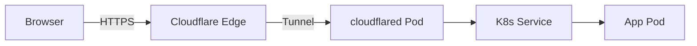

# Cloudflare Kubernetes Gateway

[](https://github.com/cnap-tech/cloudflare-kubernetes-gateway/actions/workflows/ci.yaml)
[](https://gateway-api.sigs.k8s.io/implementations/)
[](https://gateway-api.sigs.k8s.io/concepts/conformance/#conformance-profiles)

A Kubernetes [Gateway API](https://gateway-api.sigs.k8s.io/) controller that routes cluster traffic through [Cloudflare Tunnels](https://developers.cloudflare.com/cloudflare-one/connections/connect-networks/) — no public IPs or open firewall ports required.

**How it works:** The controller watches GatewayClass, Gateway, and HTTPRoute resources. For each Gateway it creates a Cloudflare Tunnel and deploys a [cloudflared](https://github.com/cloudflare/cloudflared) client. HTTPRoutes are translated into tunnel ingress rules and DNS CNAME records pointing to the tunnel.

**Conformance:** This controller passes the official [Gateway API conformance tests](https://gateway-api.sigs.k8s.io/concepts/conformance/) for the **GatewayHTTP** profile against Gateway API **v1.4.1**. Conformance tests run on every push in CI.



## Getting Started

1. Install the Gateway API CRDs (v1+):

```bash
kubectl apply -k github.com/kubernetes-sigs/gateway-api//config/crd?ref=v1.4.1
```

2. Install the controller:

```bash
kubectl apply -k github.com/cnap-tech/cloudflare-kubernetes-gateway//config/default?ref=main
```

3. [Find your Cloudflare account ID](https://developers.cloudflare.com/fundamentals/setup/find-account-and-zone-ids/) and [create an API token](https://developers.cloudflare.com/fundamentals/api/get-started/create-token/) with **Cloudflare Tunnel Edit** and **Zone DNS Edit** permissions.

4. Create the credentials Secret:

```bash
kubectl create secret -n cloudflare-gateway generic cloudflare \
  --from-literal=ACCOUNT_ID=your-account-id \
  --from-literal=TOKEN=your-api-token
```

5. Create a GatewayClass:

```yaml
apiVersion: gateway.networking.k8s.io/v1
kind: GatewayClass
metadata:
  name: cloudflare
spec:
  controllerName: github.com/cnap-tech/cloudflare-kubernetes-gateway
  parametersRef:
    group: ""
    kind: Secret
    namespace: cloudflare-gateway
    name: cloudflare
```

6. Create a Gateway and HTTPRoute:

```yaml
apiVersion: gateway.networking.k8s.io/v1
kind: Gateway
metadata:
  name: gateway
  namespace: cloudflare-gateway
spec:
  gatewayClassName: cloudflare
  listeners:
  - protocol: HTTP
    port: 80
    name: http
---
apiVersion: gateway.networking.k8s.io/v1
kind: HTTPRoute
metadata:
  name: example-route
  namespace: default
spec:
  parentRefs:
  - name: gateway
    namespace: cloudflare-gateway
  hostnames:
  - example.com
  rules:
  - backendRefs:
    - name: example-service
      port: 80
```

7. (Optional) Install Prometheus ServiceMonitors for controller and cloudflared metrics:

```bash
kubectl apply -k github.com/cnap-tech/cloudflare-kubernetes-gateway//config/prometheus?ref=main
```

## Features

- **HTTPRoute** hostname and path matching with automatic path specificity sorting
- **HTTPRoute** Service backendRefs (without filtering or weighting)
- **Gateway** lifecycle management — tunnel creation, cloudflared deployment, cleanup on deletion
- **GatewayClass** validation with Cloudflare API token verification
- **DNS management** — automatic CNAME record creation and cleanup with metadata tags
- **Two config modes** — remote (Cloudflare dashboard) or local (ConfigMap-based)
- **API proxy support** — route API calls through a custom base URL

## Configuration

The controller reads configuration from the Secret referenced by the GatewayClass `parametersRef`. Required and optional keys:

| Key | Required | Default | Description |
|-----|----------|---------|-------------|
| `ACCOUNT_ID` | Yes | — | Cloudflare account ID |
| `TOKEN` | Yes | — | Cloudflare API token |
| `API_BASE_URL` | No | `api.cloudflare.com` | Custom API base URL (for proxy setups) |
| `CONFIG_MODE` | No | `remote` | Tunnel config mode: `remote` or `local` |

### Config Modes

**Remote** (default): Tunnel ingress rules are pushed to the Cloudflare API. Routes appear in the Cloudflare dashboard. cloudflared runs with `--token` and polls for config updates.

**Local**: Ingress rules are written to a ConfigMap on the cluster. cloudflared reads from a mounted config file. The controller triggers a rolling restart when the config changes. Faster updates with no polling delay — useful for automated or high-frequency deployments.

### DNS Record Metadata

DNS records created by the controller include metadata for identification and filtering:

- **Tags**: `managed-by:cnap-gateway`, `tunnel-id:<id>`, `gateway:<namespace>/<name>`
- **Comment**: Human-readable description with Kubernetes context

Stale DNS records are automatically cleaned up using tag-based filtering when hostnames are removed from routes.

## Standalone cloudflared

By default, a cloudflared Deployment runs for each Gateway. Additional clients can be deployed ([guide](https://developers.cloudflare.com/cloudflare-one/connections/connect-networks/deploy-tunnels/deployment-guides/)) for custom replicas, tolerations, or other parameters — traffic is load-balanced across all connected clients.

To disable the built-in Deployment:

1. Create a ConfigMap:

```bash
kubectl create configmap -n cloudflare-gateway gateway --from-literal=disableDeployment=true
```

2. Reference it from the Gateway:

```yaml
apiVersion: gateway.networking.k8s.io/v1
kind: Gateway
metadata:
  name: gateway
  namespace: cloudflare-gateway
spec:
  gatewayClassName: cloudflare
  listeners:
  - protocol: HTTP
    port: 80
    name: http
  infrastructure:
    parametersRef:
      group: ""
      kind: ConfigMap
      name: gateway
```

## Credits

Forked from [alodex/cloudflare-kubernetes-gateway](https://github.com/alodex/cloudflare-kubernetes-gateway).
